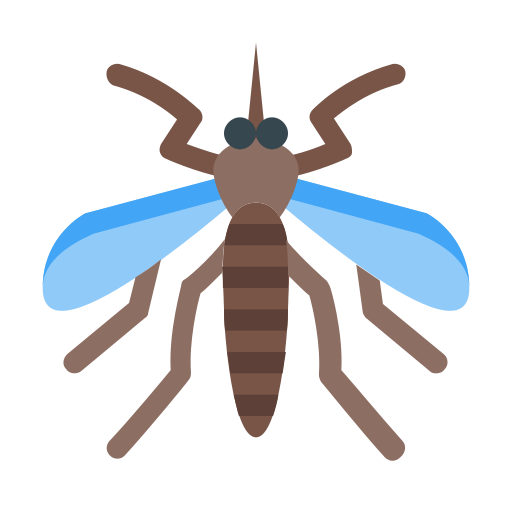

<p align="center">
  
</p>

# FlyQuest 🪰
Welcome to **FlyQuest**! A 2D Grid World environment where an AI-powered "Fly" agent learns to navigate a dynamic and dangerous room. The mission? Relentlessly hunt down a "Human" target that wanders around. The catch? The room is crawling with deadly, static Spiders. 

## Usage

- **Train the Agent**: Start training the Deep Q-Network.
  ```bash
  python train.py
  ```
- **Evaluate the Agent**: Run evaluation using the pretrained model (`fly_brain.pth`).
  ```bash
  python evaluate_agent.py
  ```
- **Data Collection**: Collect static game records.
  ```bash
  python main.py
  ```

## Monitoring & Docker

The project features a Prometheus metrics stack for monitoring training performance (total episodes, wins, spider deaths, timeouts).
To run training inside a container along with the metrics server:

1. **Start the stack**:
   ```bash
   docker-compose up --build
   ```
2. **Access Prometheus**: Navigate to `http://localhost:9090` in your browser. The training metrics are exposed on `http://localhost:8000`.

## Project Structure

- `environment.py`: Contains the core logic for the 2D Grid World game (states, steps, rewards).
- `agent.py`: Implementation of the DQN Agent, handling memory replay and training steps.
- `network.py`: PyTorch Neural Network architecture.
- `metrics.py`: Exposes Prometheus metrics for real-time tracking.
- `train.py`: The entrypoint for training the agent over multiple episodes.
- `evaluate_agent.py`: Script to test the loaded agent's performance.

---

## The Reinforcement Learning Journey

### Phase 1: Tabular Q-Learning (The Dictionary Brain)
I built a Reinforcement Learning engine from scratch using an Object-Oriented approach.
- **Environment**: A Grid World containing a Fly, a Human target, and Spider obstacles.
- **Brain**: A Q-Table implemented as a Python Dictionary mapping `(State) -> [Action Scores]`.
- **The Math**: Implemented the **Bellman Equation** to ripple rewards backward over time.
- **Rewards**: 
  - `+10` for finding the Human.
  - `-1` for every step (encouraging speed).
  - `-100` for hitting a Spider (encouraging safety).
- **Exploration vs Exploitation**: Used an `epsilon-greedy` strategy to allow the agent to discover new paths during training and stick to optimal paths during evaluation.

### Phase 2: The Curse of Dimensionality
When the Human was stationary, the Grid had 100 possible states. The Tabular Brain solved it easily. 
When I made the Human move randomly, the state space exploded to **10,000 possible states** `(fly_x, fly_y, human_x, human_y)`.
While the Fly could still learn this by training for 1,000,000 episodes, the Tabular approach hit its limit. If I added moving Spiders, the state space would become 10-Billion, requiring more RAM than exists on a computer.

### Phase 3: Deep Q-Learning (PyTorch)
To solve the Curse of Dimensionality, I transitioned to **Deep Q-Networks (DQN)**.
Instead of memorizing every possible combination in a dictionary, I built a Neural Network to *generalize* the rules of the game.
- **State Input**: 4 Neurons
- **Hidden Layers**: Two fully connected layers (`nn.Linear`) with 64 neurons each, using `ReLU` activation.
- **Action Output**: 4 Neurons representing the predicted Q-Values for `[Up, Left, Down, Right]`. No activation function (Linear) so the network can predict raw Bellman reward numbers.

### Phase 4: Stabilizing the AI
Deep Learning requires specialized techniques to train effectively without forgetting past lessons or brute-force memorizing the test.
- **Experience Replay Buffer**: Instead of learning from 1 step at a time, I store 10,000 past experiences in a `deque`. The AI learns from a random batch of 64 experiences simultaneously to prevent "Catastrophic Forgetting."
- **Epsilon Decay**: The AI starts 100% "drunk" (random exploration) and decays its exploration rate (`Epsilon *= 0.995`) every episode until it relies entirely on its Neural Network.
- **Overfitting Prevention**: Randomizing the spawn locations of the Entities so the AI learns the *concept* of chasing the human, rather than memorizing a specific mathematical map layout.

### Phase 5: The Oscillation Bug (Training Instability)
After training the DQN for 10,000 episodes with randomized spawns, the Fly exhibited a critical failure mode: instead of chasing the Human, it got **stuck oscillating in place** (bouncing up/down or pressing into a wall repeatedly). Three root causes were identified:

1. **No Step Limit**: Without a `max_steps` cap, early "drunk" episodes (epsilon ≈ 1.0) ran for thousands of steps each, flooding the Experience Replay Buffer with meaningless bouncing data. The Neural Network learned to bounce because that was 99% of its training data.
2. **No Target Network**: The same Neural Network was used to both predict Q-values AND calculate the Bellman target. Every weight update shifted the "correct answer," causing the goalposts to constantly move. This is the exact instability that **DeepMind's 2015 Atari paper** solved by introducing a frozen "Target Network" that provides stable training targets.
3. **No Timeout Penalty**: When an episode exceeded `max_steps` without the Fly catching the Human or dying, the AI received no negative feedback — it never learned that failing to catch the target is bad.

**Fixes Applied:**
- Added `max_steps = 200` per episode to cap each training run and generate clean data.
- Implemented a **Target Network**: a frozen copy of the DQN that is only used for computing the Bellman target. The frozen weights are refreshed from the live network every 100 training steps.
- Added a `-10` timeout penalty when `max_steps` is reached without resolution.

### Phase 6: The Blind Spider Problem
Even after applying the Target Network and step limit fixes, the Fly still behaved erratically. Upon investigation, I discovered a **fundamental flaw in the state representation**: the state `(fly_x, fly_y, human_x, human_y)` gives the Neural Network zero information about spider positions. The Fly was essentially navigating a **minefield blindfolded** — randomly dying to invisible obstacles that change location every episode. The Neural Network cannot learn to avoid threats it cannot see.

**Solution: Curriculum Learning** — temporarily remove Spiders from training so the Neural Network can first master the core skill of chasing a moving target. Once it proves it can reliably hunt the Human, I reintroduce Spiders with their positions included in the state vector.

### Phase 7: The Reward Imbalance Bug (Wall-Hugging)
With spiders reintroduced and visible to the network (state expanded to 10 inputs), the Fly exhibited a new failure: it spammed a single action ('d') into the right wall indefinitely, ignoring the Human entirely. 

**Root Cause**: The spider penalty (`-100`) was 10× larger than the human reward (`+10`). The Neural Network learned that **avoiding death is infinitely more important than catching the target**. The safest strategy was to press into a wall forever — costing only `-1` per step, but guaranteeing zero risk of the catastrophic `-100`. The network found a "cowardly local minimum."

**Fixes Applied:**
- **Balanced Rewards**: Reduced spider penalty from `-100` to `-10`, matching the magnitude of the human reward. Risk and reward are now equal.
- **Wall Penalty**: Added a separate `-2` penalty for hitting a wall boundary (previously treated as a normal `-1` step). This teaches the Fly that wall-hugging is wasteful.
- **Reduced Complexity**: Temporarily reduced spiders from 3 to 1 to check if the Fly master single-obstacle avoidance before scaling up.

### Phase 8: Success and Evaluation
After applying the cumulative fixes—step limits, Target Networks, timeout penalties, balanced rewards, and wall penalties—the Deep Q-Network reached a stable state. To rigorously test the training, I evaluated the saved model (`fly_brain.pth`) with a completely greedy policy (exploration rate `epsilon = 0.0`).

Running the evaluation script over **10,000 independent episodes** (where both the Human and the Spider continue to move and spawn randomly) yielded an impressive **84% win rate** (catching the target). The AI successfully demonstrated that it had learned to actively stalk a moving target while mostly navigating around deadly obstacles.
